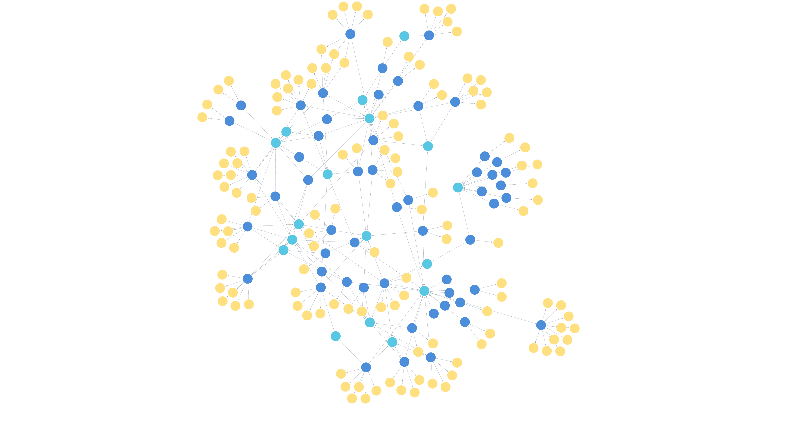
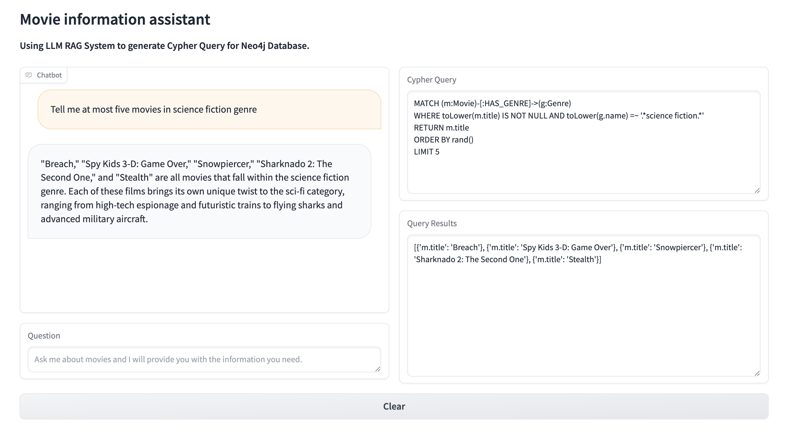
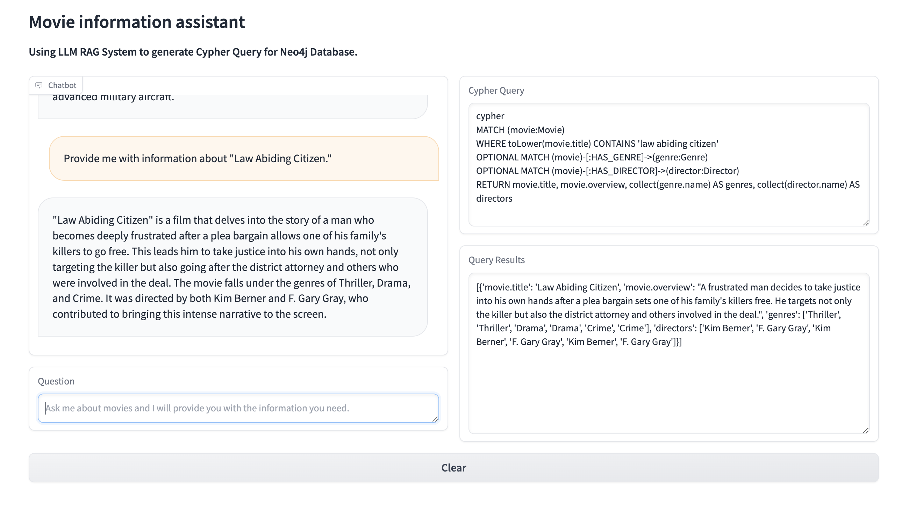

# Movie Information Assistant

## Introduction

This project aims to collect and organize movie information through the graph database, including details such as movie names, summaries, directors, and genres. Utilize neo4j to create and manage the graph database and integrate a language model (LLM) for automatically generating Cypher query statements. This approach replaces the manual search method previously used, enabling us to swiftly retrieve pertinent information from the database in response to user queries. Ultimately, a user-friendly interface has been developed, enabling interaction with the system easily and accessing the movie information of interest.

## Features

- **Graph Database Creation**: A graph database containing nodes for movies, directors, and genres is established using neo4j.
- **Automated Querying**: Integrates a language model (LLM) to automatically generate Cypher query statements to address various user queries.
- **Natural Language Processing**: Query results are interpreted by the model and presented to the user in natural language.

## Graph Database Content

The graph database includes the following types of nodes:

- **Movies**: Title, Overview
- **Directors**: Name
- **Genres**: Genre Name

Each node type is represented in a unique way and connected through relationships to form a rich network of movie information.

### Graph Database Example

## Demo

1. 2.

## Sources of Information

- **Movie-related information**: `TMDB (The Movie Database)`
- **Graph database**: `Neo4j`
- **LLM**: `OpenAI gpt-4-1106-preview`
